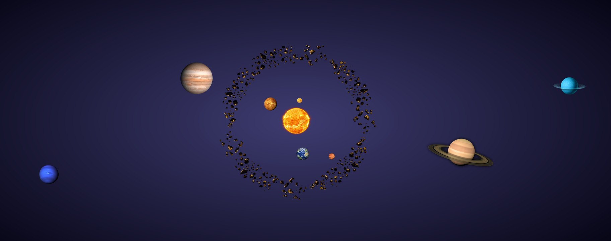

# Système solaire

### Projet d'études d'appel d'API sur une interface graphique.

Visualisation schématique du système solaire avec informations sur les astres lorsqu'on clique dessus : Nom, Taille, Masse, Distance du soleil, Révolution, Durée d'une journée, Nombre de lunes.

API utilisée : https://api.le-systeme-solaire.net/

Pour lancer le programme : double-click sur le fichier SolarSystem.html

Par le groupe des béliers inventifs : Loïck Marin, Edith Menechi, Yannick Oudin
